# GFACS: Ant Colony Sampling with GFlowNets for Combinatorial Optimization

## Repository Architecture

GFACS implements neural-guided ant colony optimization for 8 combinatorial optimization problems using GFlowNet sampling. The repository is organized into problem-specific modules, each containing ACO implementations, neural networks, training/testing scripts, and utilities.

## Core Architecture

```mermaid
graph TB
    subgraph "Root Level"
        root[GFACS Root]
        root --> config[Configuration Files]
        root --> data[Data Directory]
        root --> pretrained[Pretrained Models]
        root --> scripts[Setup Scripts]

        config --> pyproject[pyproject.toml]
        config --> readme[README.md]
        config --> agents[AGENTS.md]
        config --> license[LICENSE]

        scripts --> setup_env[setup_env.sh]
        scripts --> setup_solvers[setup_solvers.sh]
        scripts --> verify[verify_install.py]
    end

    subgraph "Problem Modules"
        modules[8 Problem Modules]
        modules --> tsp[tsp_nls]
        modules --> cvrp[cvrp_nls]
        modules --> cvrptw[cvrptw_nls]
        modules --> bpp[bpp]
        modules --> op[op]
        modules --> pctsp[pctsp]
        modules --> smtwtp[smtwtp]
        modules --> sop[sop]
    end

    subgraph "Module Structure"
        template[Each Module Contains]
        template --> aco[aco.py - ACO Implementation]
        template --> net[net.py - Neural Networks]
        template --> train[train.py - Training Script]
        template --> test[test.py - Testing Script]
        template --> utils[utils.py - Utilities]
        template --> readme[README.md - Documentation]
        template --> agents[AGENTS.md - API Docs]
    end

    subgraph "External Dependencies"
        solvers[External Solvers]
        solvers --> hgs[HGS-CVRP C++ Solver]
        solvers --> concorde[Concorde TSP Solver]
        solvers --> pyvrp[PyVRP Library]
    end

    tsp --> concorde
    cvrp --> hgs
    cvrptw --> pyvrp
```



## Problem Modules Overview

### 1. TSP with Neural Local Search (`tsp_nls/`)
**Problem**: Traveling Salesman Problem with neural-guided local search
- **Algorithm**: Ant Colony Optimization + GFlowNet sampling + 2-opt local search
- **Local Search**: Custom 2-opt implementation with Concorde integration
- **Key Features**:
  - Neural heuristic learning via GFlowNet
  - Guided exploration combining pre-local-search and post-local-search costs
  - TSPLIB benchmark support

### 2. CVRP with Neural Local Search (`cvrp_nls/`)
**Problem**: Capacitated Vehicle Routing Problem with HGS local search
- **Algorithm**: ACO + GFlowNet + HGS-CVRP local search
- **Local Search**: HGS (Hybrid Genetic Search) C++ solver integration
- **Key Features**:
  - Capacity constraints handling
  - Multi-route optimization
  - HGS-CVRP external solver integration

### 3. CVRPTW with PyVRP (`cvrptw_nls/`)
**Problem**: Capacitated Vehicle Routing Problem with Time Windows
- **Algorithm**: ACO + GFlowNet + PyVRP local search
- **Local Search**: PyVRP library for time window constraints
- **Key Features**:
  - Time window constraints
  - PyVRP integration for local search
  - Capacity and temporal constraints

### 4. Bin Packing Problem (`bpp/`)
**Problem**: One-dimensional bin packing
- **Algorithm**: ACO + GFlowNet
- **Key Features**:
  - Capacity-based bin assignment
  - Fitness function based on bin usage
  - Heuristic-guided item placement

### 5. Orienteering Problem (`op/`)
**Problem**: Orienteering problem (TSP with profits and time constraints)
- **Algorithm**: ACO + GFlowNet
- **Key Features**:
  - Profit maximization under time constraints
  - Selective node visiting
  - Score-based optimization

### 6. Prize Collecting TSP (`pctsp/`)
**Problem**: TSP variant with node prizes and penalties
- **Algorithm**: ACO + GFlowNet
- **Key Features**:
  - Prize collection incentives
  - Penalty for unvisited nodes
  - Trade-off between tour length and collected prizes

### 7. Single Machine Total Weighted Tardiness Problem (`smtwtp/`)
**Problem**: Single machine scheduling with weighted tardiness
- **Algorithm**: ACO + GFlowNet
- **Key Features**:
  - Job scheduling optimization
  - Weighted tardiness minimization
  - Sequence-dependent processing

### 8. Sequential Ordering Problem (`sop/`)
**Problem**: Sequential ordering with precedence constraints
- **Algorithm**: ACO + GFlowNet
- **Key Features**:
  - Precedence constraint satisfaction
  - Sequential ordering optimization
  - Constraint-aware path generation

## Core Components

### ACO Implementation (`aco.py`)

**Base ACO Class**:
```python
class ACO:
    def __init__(
        self,
        distances: torch.Tensor,
        n_ants: int = 20,
        heuristic: torch.Tensor | None = None,
        k_sparse: int | None = None,
        pheromone: torch.Tensor | None = None,
        decay: float = 0.9,
        alpha: float = 1.0,
        beta: float = 1.0,
        local_search_type: str | None = None,
        device: str = 'cpu'
    )
```

**Key Methods**:
- `sample()` - Generate ant paths using current pheromone and heuristic
- `run()` - Execute full ACO iterations with pheromone updates
- `local_search()` - Apply local search improvements
- `update_pheromone()` - Update pheromone trails based on solution quality

**ACO Variants Supported**:
- Standard Ant System (AS)
- Elitist Ant System
- MAX-MIN Ant System
- Rank-based Ant System

### Neural Network Architecture (`net.py`)

**EmbNet - Edge Embedding Network**:
```python
class EmbNet(nn.Module):
    def __init__(
        self,
        depth: int = 12,
        feats: int = 2,
        units: int = 32,
        act_fn: str = 'silu',
        agg_fn: str = 'mean'
    )
```

**Architecture Components**:
- **Node Encoder**: Initial node feature processing
- **Edge Encoder**: Distance/cost information encoding
- **Message Passing**: Multi-layer GNN with residual connections
- **Parameter Networks**: Heuristic parameter prediction (ParNet)
- **Z-Network**: Log-partition function estimation for GFlowNets

**Key Features**:
- Configurable depth and width
- Batch normalization and activation functions
- Global pooling operations
- Sigmoid outputs for probability distributions

### Training Framework (`train.py`)

**Training Components**:
- **Instance Training**: Train on individual problem instances
- **Batch Processing**: Parallel training across multiple instances
- **Validation**: Periodic model validation with held-out data
- **W&B Integration**: Experiment tracking and logging
- **Checkpointing**: Model saving and resuming

**Key Hyperparameters**:
- `n_ants`: Number of ants per iteration
- `invtemp`: Inverse temperature for sampling
- `beta`: Energy scaling factor
- `cost_w`: Weight between pre/post local search costs
- `guided_exploration`: Use post-local-search costs for training

### Testing Framework (`test.py`)

**Testing Components**:
- **Inference**: Model evaluation on test instances
- **ACO Variants**: Support for different ACO algorithms
- **Metrics**: Cost, diversity, and timing measurements
- **Benchmarking**: TSPLIB and other standard benchmarks

### Utilities (`utils.py`)

**Data Processing**:
- `gen_distance_matrix()` - Euclidean distance computation
- `gen_pyg_data()` - Convert to PyTorch Geometric format
- `load_test_dataset()` - Dataset loading and preprocessing
- `load_val_dataset()` - Validation data generation

**Data Formats**:
- **PyG Data**: torch_geometric.data.Data objects
- **Distance Matrices**: torch.Tensor [n_nodes, n_nodes]
- **Node Features**: torch.Tensor [n_nodes, n_features]

## Data Organization

### Data Directory Structure
```
data/
├── tsp/
│   ├── testDataset-{size}.pt    # Generated test instances
│   ├── valDataset-{size}.pt     # Validation instances
│   └── tsplib/                  # TSPLIB benchmark instances
├── cvrp/
│   ├── vrp{size}_{k_sparse}.pkl # CVRP instances
│   └── vrplib/                  # VRP benchmark instances
```

### Pretrained Models Structure
```
pretrained/
├── {problem}/
│   ├── {size}/
│   │   └── {config}/
│   │       └── {epoch}.pt
```

## External Solver Integration

### HGS-CVRP (Hybrid Genetic Search)
- **Location**: `cvrp_nls/HGS-CVRP-main/`
- **Build Process**: CMake-based compilation
- **Interface**: C API with ctypes binding
- **Purpose**: High-quality local search for CVRP

### Concorde TSP Solver
- **Location**: `tsp_nls/concorde/`
- **Build Process**: Custom build script
- **Interface**: Command-line execution
- **Purpose**: Exact TSP solving for verification

### PyVRP Library
- **Location**: Python package (pyvrp)
- **Interface**: Native Python API
- **Purpose**: Local search for VRPTW constraints

## Dependencies and Requirements

### Core Dependencies
- **Python**: 3.11+
- **PyTorch**: 2.1.1+ (with CUDA support recommended)
- **PyTorch Geometric**: 2.4.0+
- **NumPy**: 1.23.5+
- **Numba**: 0.58.1+
- **SciPy**: 1.10.1+

### Optional Dependencies
- **PyVRP**: For CVRPTW local search
- **W&B**: Experiment tracking
- **Development**: pytest, black, mypy, etc.

## API Reference

### Command Line Interfaces

**Training**:
```bash
gfacs-train-{problem} {size} [options]
```

**Testing**:
```bash
gfacs-test-{problem} {size} -p {checkpoint_path} [options]
```

**Verification**:
```bash
gfacs-verify
```

### Python API

**Basic Usage**:
```python
from gfacs.{problem}.aco import ACO
from gfacs.{problem}.net import Net

# Load model
model = Net(gfn=True)
model.load_state_dict(torch.load(checkpoint_path))

# Create ACO instance
aco = ACO(distances, n_ants=20, heuristic=heu_mat)

# Solve
costs, log_probs, paths = aco.sample()
```

## Performance Characteristics

### Time Complexity
- **ACO Sampling**: O(n_ants × n_nodes²)
- **Neural Forward Pass**: O(n_nodes² × depth)
- **Local Search**: Problem-dependent (O(n³) for 2-opt, faster for HGS)

### Space Complexity
- **Distance Matrices**: O(n_nodes²)
- **Neural Networks**: O(n_nodes² × depth × units)
- **Pheromone Matrices**: O(n_nodes²)

### Scalability
- **Small instances** (n ≤ 100): Fast convergence, high quality
- **Medium instances** (100 < n ≤ 500): Good performance with local search
- **Large instances** (n > 500): Memory intensive, requires sparse representations

## Development Guidelines

### Code Style
- **Type Hints**: All public functions must have type annotations
- **Docstrings**: NumPy/Google style docstrings required
- **Naming**: Descriptive, no redundant adjectives
- **Logging**: Structured logging with appropriate levels

### Testing
- **Coverage**: >80% code coverage required
- **Unit Tests**: Individual component testing
- **Integration Tests**: End-to-end workflow verification
- **Fixtures**: Reusable test data and models

### Documentation
- **README.md**: User-facing installation and usage
- **AGENTS.md**: Developer-facing API documentation
- **Inline Comments**: Complex algorithm explanations
- **Examples**: Usage examples in docstrings

## Research Context

This implementation is based on the paper:
> Kim, M., Choi, S., Son, J., Kim, H., Park, J., & Bengio, Y. (2024). Ant Colony Sampling with GFlowNets for Combinatorial Optimization. arXiv preprint arXiv:2403.07041.

### Key Innovations
1. **GFlowNet Integration**: Novel combination of ACO with generative flow networks
2. **Guided Exploration**: Training on post-local-search costs for better exploration
3. **Neural Local Search**: Learning effective local search heuristics
4. **Scalable Architecture**: Unified framework across multiple problem types

### Contributions
- Unified framework for multiple combinatorial problems
- Neural-guided local search integration
- Open-source implementation with comprehensive documentation
- Benchmark results on standard problem instances
