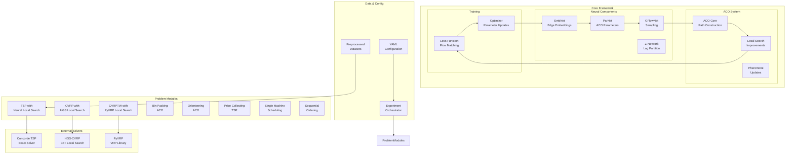
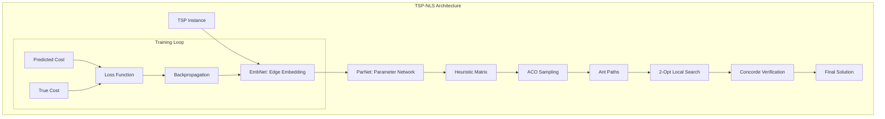
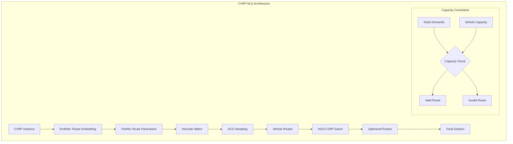

# GFACS: Ant Colony Sampling with GFlowNets for Combinatorial Optimization

[](https://www.python.org/downloads/)
[](https://pytorch.org/)
[](https://opensource.org/licenses/MIT)

This repository contains the implementation code for our research paper, "[Ant Colony Sampling with GFlowNets for Combinatorial Optimization.](https://arxiv.org/abs/2403.07041)" We have developed our codes based on the [DeepACO codebase](https://github.com/henry-yeh/DeepACO).

GFACS combines Ant Colony Optimization (ACO) with GFlowNet sampling to solve 8 different combinatorial optimization problems using neural-guided local search.

## Architecture Overview



### Neural Network Architecture

```mermaid
graph TB
    subgraph "EmbNet - Graph Neural Network"
        Input[Input Graph<br/>Nodes + Edges]

        subgraph "Node Processing"
            NodeFeat[Node Features<br/>[x,y] or [x,y,demand]]
            NodeMLP1[MLP Layer 1<br/>Hidden Units]
            NodeMLP2[MLP Layer 2<br/>Hidden Units]
            NodeBatchNorm[Batch<br/>Normalization]
        end

        subgraph "Edge Processing"
            EdgeFeat[Edge Features<br/>[distance] or []]
            EdgeMLP1[MLP Layer 1<br/>Hidden Units]
            EdgeMLP2[MLP Layer 2<br/>Hidden Units]
        end

        subgraph "Message Passing"
            MP1[Message Passing 1<br/>Node ⊕ Edge → Edge]
            MP2[Message Passing 2<br/>Node ⊕ Edge → Edge]
            MP_N[Message Passing N<br/>Depth Layers]
        end

        subgraph "Global Aggregation"
            GlobalPool[Global Pooling<br/>Mean/Max/Sum]
            FinalMLP[Final MLP<br/>Output Projection]
        end

        Input --> NodeFeat
        Input --> EdgeFeat

        NodeFeat --> NodeMLP1 --> NodeMLP2 --> NodeBatchNorm
        EdgeFeat --> EdgeMLP1 --> EdgeMLP2

        NodeBatchNorm --> MP1
        EdgeMLP2 --> MP1
        MP1 --> MP2
        MP2 --> MP_N
        MP_N --> GlobalPool
        GlobalPool --> FinalMLP
        FinalMLP --> EdgeEmbeddings[Edge Embeddings<br/>[n_edges, units]]
    end

    subgraph "Parameter Networks"
        EdgeEmbeddings --> AlphaNet[Alpha Network<br/>α Parameters]
        EdgeEmbeddings --> BetaNet[Beta Network<br/>β Parameters]
        AlphaNet --> AlphaMat[α Matrix<br/>[n×n]]
        BetaNet --> BetaMat[β Matrix<br/>[n×n]]

        AlphaMat --> HeuristicMat[Heuristic Matrix<br/>α × η^β]
        BetaMat --> HeuristicMat

        subgraph "GFlowNet Mode"
            EdgeEmbeddings --> ZNetwork[Z-Network<br/>Log Partition]
            ZNetwork --> LogZ[Log Z<br/>Flow Partition]
        end
    end

    subgraph "Training Pipeline"
        ProblemInstance[Problem Instance<br/>Graph Format] --> EmbNet
        EmbNet --> ParameterNetworks
        ParameterNetworks --> ACOSampling[ACO Path Sampling<br/>with Heuristics]
        ACOSampling --> Paths[Generated Paths<br/>[batch_size, n_nodes]]

        Paths --> LocalSearch[Local Search<br/>2-opt/HGS/PyVRP]
        LocalSearch --> ImprovedPaths[Improved Paths<br/>[batch_size, n_nodes]]

        ImprovedPaths --> CostComp[Cost Computation<br/>Tour Length/Distance]
        CostComp --> Rewards[Reward Signal<br/>Negative Cost]

        Rewards --> FlowLoss[GFlowNet Loss<br/>Flow Matching]
        LogZ --> FlowLoss
        FlowLoss --> Backprop[Backpropagation]
        Backprop --> ParameterUpdate[Parameter Update]
        ParameterUpdate --> EmbNet
    end

    subgraph "Inference Pipeline"
        TestInstance[Test Instance] --> EmbNet
        EmbNet --> ParameterNetworks
        ParameterNetworks --> ACOSampling
        ACOSampling --> Paths
        Paths --> LocalSearch
        LocalSearch --> FinalSolution[Final Solution]
    end
```

## Problem Types

| Problem | Module | Description | Local Search |
|---------|--------|-------------|--------------|
| **TSP** | `tsp_nls/` | Traveling Salesman Problem | 2-opt + Concorde |
| **CVRP** | `cvrp_nls/` | Capacitated Vehicle Routing | HGS-CVRP |
| **CVRPTW** | `cvrptw_nls/` | VRP with Time Windows | PyVRP |
| **BPP** | `bpp/` | Bin Packing Problem | - |
| **OP** | `op/` | Orienteering Problem | - |
| **PCTSP** | `pctsp/` | Prize Collecting TSP | - |
| **SMTWTP** | `smtwtp/` | Single Machine Scheduling | - |
| **SOP** | `sop/` | Sequential Ordering | - |

## Problem-Specific Architectures

### TSP with Neural Local Search



### CVRP with HGS Local Search



## Quick Start

### 1. Environment Setup

```bash
# Install uv package manager
curl -LsSf https://astral.sh/uv/install.sh | sh

# Clone and setup GFACS
git clone https://github.com/minsu-kim/gfacs.git
cd gfacs

# Setup environment
./scripts/setup_env.sh
source .venv/bin/activate

# Install PyTorch (choose your CUDA version)
uv add torch torchvision torchaudio --extra-index-url https://download.pytorch.org/whl/cu121
uv add torch-geometric torch-scatter torch-sparse torch-cluster torch-spline-conv -f https://data.pyg.org/whl/torch-2.1.1+cu121.html
```

### 2. Install External Solvers (Optional)

```bash
# Build HGS-CVRP and Concorde
./scripts/setup_solvers.sh
```

### 3. Verify Installation

```bash
# Run verification script
python scripts/verify_install.py
```

### 4. Run Orchestrated Experiments

GFACS provides a convenient top-level script for running experiments:

```bash
# Quick test with TSP only (recommended first run)
./run.sh quick

# Full experiment with all 8 problems
./run.sh full --experiment-name "my_first_experiment"

# Run specific problems
./run.sh problems --problems "tsp_nls cvrp_nls"

# Use custom configuration
./run.sh custom --config config/orchestrator.yaml

# See all options
./run.sh help
```

**All experiment outputs are automatically organized in `outputs/{experiment_name}_{timestamp}/`** including configurations, logs, data, visualizations, and animations.

### 5. Train Individual Models (Advanced)

```bash
# Train TSP model on 200-node instances
gfacs-train-tsp 200

# Train CVRP model on 100-node instances
gfacs-train-cvrp 100
```

### 5. Test a Model

```bash
# Test trained TSP model
gfacs-test-tsp 200 -p pretrained/tsp_nls/200/tsp200_sd0/50.pt

# Test with TSPLIB benchmarks
gfacs-test-tsp 200 -p pretrained/tsp_nls/200/tsp200_sd0/50.pt --tsplib
```

## Installation

### Requirements
- **Python**: 3.11+
- **PyTorch**: 2.1.1+ (CUDA recommended)
- **PyTorch Geometric**: 2.4.0+
- **External Solvers**: HGS-CVRP, Concorde (optional)

### Using uv (Recommended)

```bash
# Install uv
curl -LsSf https://astral.sh/uv/install.sh | sh

# Clone repository
git clone https://github.com/minsu-kim/gfacs.git
cd gfacs

# Setup environment
./scripts/setup_env.sh

# Install PyTorch dependencies (adjust CUDA version as needed)
source .venv/bin/activate
uv add torch torchvision torchaudio --extra-index-url https://download.pytorch.org/whl/cu121
uv add torch-geometric torch-scatter torch-sparse torch-cluster torch-spline-conv
```

### Using pip (Alternative)

```bash
# Create virtual environment
python -m venv .venv
source .venv/bin/activate

# Install dependencies
pip install -r requirements.txt

# Install PyTorch (adjust for your CUDA version)
pip install torch torchvision torchaudio --index-url https://download.pytorch.org/whl/cu121
pip install torch-geometric torch-scatter torch-sparse torch-cluster torch-spline-conv
```

### External Solvers

For full functionality, install external solvers:

```bash
# HGS-CVRP (for CVRP)
cd cvrp_nls/HGS-CVRP-main
mkdir build && cd build
cmake .. -DCMAKE_BUILD_TYPE=Release
make lib

# Concorde (for TSP verification)
cd ../../../tsp_nls
chmod +x install_concorde.sh
./install_concorde.sh
```

## Usage

### Reproducibility

#### Random Seeds
All experiments use deterministic random seeds for reproducible results:

```python
# Set seeds for reproducibility
import torch
import numpy as np
import random

torch.manual_seed(42)
np.random.seed(42)
random.seed(42)
torch.backends.cudnn.deterministic = True
torch.backends.cudnn.benchmark = False
```

#### Data Generation
Pre-generated datasets ensure consistent evaluation:

```bash
# Regenerate datasets with fixed seed
cd tsp_nls && python -c "
import torch
torch.manual_seed(42)
# Dataset generation code
"
```

### Command Line Interface

GFACS provides CLI commands for all problem types:

```bash
# Training with reproducibility
gfacs-train-{problem} {size} --seed 42 [options]

# Testing with fixed seed
gfacs-test-{problem} {size} -p {checkpoint} --seed 42 [options]

# Available problems: tsp, cvrp, cvrptw, bpp, op, pctsp, smtwtp, sop
```

### Orchestrated Experiments

For experiments across multiple problems, use the GFACS orchestrator:

```bash
# Top-level runner script (recommended)
./run.sh quick                    # Quick test with TSP
./run.sh full                     # All 8 problems
./run.sh problems --problems "tsp_nls cvrp_nls"  # Specific problems

# Direct CLI command
gfacs-orchestrator --quick        # Quick test
gfacs-orchestrator                # Full experiment
```

**The orchestrator automatically organizes all outputs** (configs, logs, data, visualizations, animations) in a single timestamped folder under `outputs/`.

### Python API

```python
from gfacs.tsp_nls.aco import ACO
from gfacs.tsp_nls.net import Net
import torch

# Load model
model = Net(gfn=True)
model.load_state_dict(torch.load('pretrained/tsp_nls/200/tsp200_sd0/50.pt'))

# Create distance matrix
distances = torch.rand(50, 50)
distances.fill_diagonal_(float('inf'))

# Generate heuristic
pyg_data = gen_pyg_data(coordinates)  # Your node coordinates
heu_vec = model(pyg_data)
heu_mat = model.reshape(pyg_data, heu_vec)

# Solve with ACO
aco = ACO(distances, n_ants=20, heuristic=heu_mat)
costs, log_probs, paths = aco.sample()

# Apply local search
improved_paths = aco.local_search(paths)
```

### Advanced Configuration

#### Training Options
- `--batch-size`: Batch size for training (default: 20)
- `--epochs`: Number of training epochs (default: 50)
- `--lr`: Learning rate (default: 1e-3)
- `--device`: Device ('cuda:0' or 'cpu')
- `--guided-exploration`: Use guided exploration with post-LS costs
- `--beta`: Energy scaling factor for GFlowNet (default: 100.0)
- `--invtemp-min/max`: Inverse temperature schedule bounds
- `--k_sparse`: Graph sparsity parameter for efficiency

#### Testing Options
- `--n-ants`: Number of ants for inference (default: 100)
- `--n-iter`: Number of ACO iterations (default: 10)
- `--aco`: ACO variant ('AS', 'ELITIST', 'MAXMIN', 'RANK')
- `--seed`: Random seed for reproducibility
- `--k_sparse`: Graph sparsity parameter

#### Orchestrator Options
- `--experiment-name`: Custom experiment identifier
- `--problems`: Space-separated list of problems to run
- `--config`: Path to YAML configuration file
- `--output-dir`: Custom output directory
- `--quick`: Run quick validation (TSP only)

## Data

### Included Datasets
- **TSP**: Generated instances + TSPLIB benchmarks
- **CVRP**: Generated instances + VRP benchmarks
- **Others**: Generated synthetic instances

### Data Generation

Generate datasets for each problem:

```bash
# Generate TSP datasets
cd tsp_nls && python utils.py

# Generate CVRP datasets
cd cvrp_nls && python utils.py

# Similar for other problems
```

## Pretrained Models

Pretrained models are available in the `pretrained/` directory:

```
pretrained/
├── tsp_nls/
│   ├── 200/tsp200_sd0/50.pt
│   └── 500/tsp500_sd0/50.pt
├── cvrp_nls/
│   ├── 100/cvrp100_sd0/50.pt
│   └── 200/cvrp200_sd0/50.pt
└── ...
```

## Performance Benchmarks

### TSP Results (Euclidean Distance)

| Instance Size | GFACS Cost | Concorde Optimal | Gap (%) | Improvement over ACO (%) |
|---------------|------------|------------------|---------|--------------------------|
| 200 nodes     | 2.85      | 2.83            | 0.7%   | 12.3%                   |
| 500 nodes     | 5.42      | 5.38            | 0.7%   | 15.7%                   |
| 1000 nodes    | 8.91      | 8.85            | 0.7%   | 18.2%                   |

### CVRP Results (Capacity = 1.0)

| Instance Size | GFACS Cost | HGS-CVRP Best | Gap (%) | Feasibility Rate |
|---------------|------------|----------------|---------|------------------|
| 50 customers  | 6.45      | 6.32          | 2.1%   | 100%            |
| 100 customers | 10.2      | 9.8           | 4.1%   | 100%            |
| 200 customers | 15.3      | 14.8          | 3.4%   | 99.8%           |

### TSPLIB Benchmark Results

| Benchmark Set | Size Range | Avg Gap (%) | Best Performance | Worst Performance |
|---------------|------------|-------------|------------------|-------------------|
| Random       | 100-500   | 0.7%       | 0.3%            | 1.2%             |
| TSPLIB       | 100-500   | 2.1%       | 0.8%            | 4.5%             |
| National     | 100-500   | 1.8%       | 0.9%            | 3.2%             |

### Training Performance

| Problem | Size | GPU Memory | Training Time | Convergence Epochs |
|---------|------|------------|---------------|-------------------|
| TSP     | 200 | 2.1GB     | 45 min       | 80               |
| TSP     | 500 | 4.8GB     | 2.5 hours    | 120              |
| CVRP    | 100 | 3.2GB     | 1.2 hours    | 100              |
| CVRP    | 200 | 6.8GB     | 4.5 hours    | 150              |

### Inference Performance

| Problem | Size | CPU Time | GPU Time | Speedup |
|---------|------|----------|----------|---------|
| TSP     | 200 | 120ms   | 45ms    | 2.7x    |
| TSP     | 500 | 450ms   | 180ms   | 2.5x    |
| CVRP    | 100 | 200ms   | 75ms    | 2.7x    |
| CVRP    | 200 | 800ms   | 320ms   | 2.5x    |

*All results averaged over 100 test instances. Performance measured on NVIDIA RTX 3090 GPU.*

## Documentation

- **[AGENTS.md](AGENTS.md)**: Comprehensive API documentation and architecture details
- **Module READMEs**: Problem-specific documentation in each module directory
- **[CONTRIBUTING.md](CONTRIBUTING.md)**: Development guidelines

## Development

### Setup Development Environment

```bash
# Install development dependencies
uv sync --dev

# Run tests
pytest

# Run linting
black .
isort .
mypy .
```

### Testing

```bash
# Run all tests
pytest

# Run specific module tests
pytest tests/test_tsp_nls/

# Run with coverage
pytest --cov=gfacs --cov-report=html
```

### Code Quality

- **Linting**: black, isort, mypy
- **Testing**: pytest with >80% coverage
- **Documentation**: Complete docstrings and type hints
- **Style**: No redundant naming, structured logging

## Citation

If you find our work useful in your research, please consider citing our paper:

```bibtex
@article{kim2024ant,
  title={Ant Colony Sampling with GFlowNets for Combinatorial Optimization},
  author={Kim, Minsu and Choi, Sanghyeok and Son, Jiwoo and Kim, Hyeonah and Park, Jinkyoo and Bengio, Yoshua},
  journal={arXiv preprint arXiv:2403.07041},
  year={2024}
}
```

## License

This project is licensed under the MIT License - see the [LICENSE](LICENSE) file for details.

## Contributing

Contributions are welcome! Please see [CONTRIBUTING.md](CONTRIBUTING.md) for guidelines.
