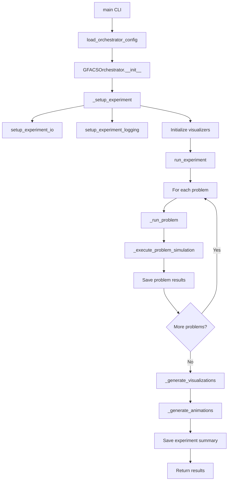

# Module: GFACS Orchestrator (`gfacs/`)

## Overview

The GFACS orchestrator provides a unified framework for running comprehensive experiments across all GFACS problem types. It manages experiment execution, result collection, visualization generation, and output organization in a structured directory hierarchy.

**Key Features:**
- Unified experiment execution across 8 problem types
- Automated output organization and metadata collection
- Integrated visualization and animation generation
- Configurable problem execution with resource management
- Comprehensive logging and progress tracking

## Core Classes

### ProblemConfig - Problem Configuration

```python
@dataclass
class ProblemConfig:
    """Configuration for a single problem."""
    name: str
    size: int
    enabled: bool = True
    n_ants: int = 50
    n_iterations: int = 100
    device: str = "cpu"
    extra_args: Dict[str, Any] = field(default_factory=dict)
```

**Parameters:**
- `name` (str): Problem identifier ('tsp_nls', 'cvrp_nls', 'cvrptw_nls', 'bpp', 'op', 'pctsp', 'smtwtp', 'sop')
- `size` (int): Problem instance size (number of nodes/items)
- `enabled` (bool): Whether to run this problem (default: True)
- `n_ants` (int): Number of ants per iteration (default: 50)
- `n_iterations` (int): Number of ACO iterations (default: 100)
- `device` (str): Computation device ('cpu', 'cuda') (default: 'cpu')
- `extra_args` (Dict[str, Any]): Additional problem-specific arguments (default: empty dict)

### OrchestratorConfig - Experiment Configuration

```python
@dataclass
class OrchestratorConfig:
    """Configuration for the orchestrator."""
    experiment_name: str = "gfacs_experiment"
    problems: List[ProblemConfig] = field(default_factory=list)
    base_output_dir: str = "outputs"
    enable_visualizations: bool = True
    enable_animations: bool = True
    log_level: str = "INFO"
    max_parallel_problems: int = 1  # Sequential for now
    seed: int = 42
```

**Parameters:**
- `experiment_name` (str): Name for the experiment (default: 'gfacs_experiment')
- `problems` (List[ProblemConfig]): List of problem configurations (default: empty, uses defaults)
- `base_output_dir` (str): Base directory for outputs (default: 'outputs')
- `enable_visualizations` (bool): Generate static visualizations (default: True)
- `enable_animations` (bool): Generate animated visualizations (default: True)
- `log_level` (str): Logging level ('DEBUG', 'INFO', 'WARNING', 'ERROR') (default: 'INFO')
- `max_parallel_problems` (int): Maximum parallel problem execution (default: 1, sequential)
- `seed` (int): Random seed for reproducibility (default: 42)

#### _get_default_problems() -> List[ProblemConfig]

Returns default problem configurations for all 8 GFACS problems.

**Returns:**
- `List[ProblemConfig]`: Default configurations for TSP, CVRP, CVRPTW, BPP, OP, PCTSP, SMTWTP, SOP

### GFACSOrchestrator - Main Orchestrator Class

```python
class GFACSOrchestrator:
    """Thin orchestrator for comprehensive GFACS experiments.

    Manages execution of simulations across multiple problem types,
    collecting all outputs in a unified directory structure.
    """

    def __init__(self, config: OrchestratorConfig) -> None:
        """Initialize orchestrator.

        Args:
            config: Orchestrator configuration
        """
```

#### run_experiment() -> Dict[str, Any]

Execute the complete experiment across all configured problems.

**Returns:**
- `Dict[str, Any]`: Experiment results with metadata, problem results, timing, and output paths

#### _setup_experiment() -> None

Setup experiment infrastructure including directories, logging, and visualizers.

#### _run_problem(problem_config: ProblemConfig) -> Dict[str, Any]

Execute simulation for a single problem.

**Parameters:**
- `problem_config` (ProblemConfig): Problem configuration

**Returns:**
- `Dict[str, Any]`: Problem results including costs, timing, and metadata

#### _execute_problem_simulation(problem_config: ProblemConfig) -> Dict[str, Any]

Execute simulation for a specific problem using the appropriate test function.

**Parameters:**
- `problem_config` (ProblemConfig): Problem configuration

**Returns:**
- `Dict[str, Any]`: Simulation results with best cost, mean cost, iterations, and metadata

#### _generate_visualizations(problem_results: Dict[str, Any]) -> None

Generate comprehensive visualizations from experiment results.

**Parameters:**
- `problem_results` (Dict[str, Any]): Results from all executed problems

#### _generate_animations(problem_results: Dict[str, Any]) -> None

Generate animated visualizations showing algorithm progress and dynamics.

**Parameters:**
- `problem_results` (Dict[str, Any]): Results from all executed problems

## Module Functions

### load_orchestrator_config(config_path: Optional[str] = None) -> OrchestratorConfig

Load orchestrator configuration from YAML file or create default.

**Parameters:**
- `config_path` (Optional[str]): Path to YAML configuration file

**Returns:**
- `OrchestratorConfig`: Loaded or default configuration

### run_orchestrator(config_path: Optional[str] = None, experiment_name: Optional[str] = None, problems: Optional[List[str]] = None, output_dir: str = "outputs") -> Dict[str, Any]

Run GFACS orchestrator with command-line interface.

**Parameters:**
- `config_path` (Optional[str]): Path to configuration file
- `experiment_name` (Optional[str]): Custom experiment name
- `problems` (Optional[List[str]]): List of problems to run
- `output_dir` (str): Base output directory (default: 'outputs')

**Returns:**
- `Dict[str, Any]`: Experiment results

### main()

Command-line interface entry point for the orchestrator.

## Execution Workflow



## Output Structure

The orchestrator creates a timestamped experiment directory with the following structure:

```
outputs/{experiment_name}_{timestamp}/
├── config/                 # All configuration files
│   └── experiment.yaml     # Main experiment configuration
├── logs/                   # All logging outputs
│   ├── orchestrator.log    # Main execution log
│   ├── orchestrator_error.log  # Error log
│   └── orchestrator.jsonl  # Structured JSON logs
├── data/                   # All input/output data
│   ├── inputs/            # Input problem instances
│   ├── results/           # Aggregated results
│   │   ├── summary.json   # Overall experiment summary
│   │   └── per_problem/   # Problem-specific results
│   ├── metrics/           # Training metrics
│   └── checkpoints/       # Model checkpoints
├── visualizations/        # Static plots and charts
│   ├── cross_problem_comparison.png
│   ├── runtime_comparison.png
│   ├── solution_quality_distribution.png
│   ├── performance_summary.png
│   └── experiment_report.png
└── animations/            # Animated visualizations
    ├── multi_problem_convergence.gif
    ├── tsp_tour_construction.gif
    ├── pheromone_evolution.gif
    ├── aco_convergence.gif
    └── experiment_progress.gif
```

## Usage Examples

### Basic Orchestrator Usage

```python
from gfacs import GFACSOrchestrator, OrchestratorConfig, ProblemConfig

# Configure experiment
config = OrchestratorConfig(
    experiment_name="my_gfacs_experiment",
    problems=[
        ProblemConfig(name="tsp_nls", size=100, n_ants=50),
        ProblemConfig(name="cvrp_nls", size=50, n_ants=30),
    ],
    enable_visualizations=True,
    enable_animations=False
)

# Run experiment
orchestrator = GFACSOrchestrator(config)
results = orchestrator.run_experiment()

print(f"Experiment completed in {results['duration']:.2f}s")
print(f"Results saved to: {results['output_directory']}")
```

### Configuration File Usage

```yaml
# config/orchestrator.yaml
experiment_name: "comprehensive_benchmark"
problems:
  - name: "tsp_nls"
    size: 200
    n_ants: 100
    n_iterations: 200
  - name: "cvrp_nls"
    size: 100
    n_ants: 50
  - name: "cvrptw_nls"
    size: 50
    n_ants: 30
enable_visualizations: true
enable_animations: true
log_level: "INFO"
seed: 42
```

```python
from gfacs import load_orchestrator_config, GFACSOrchestrator

# Load from YAML
config = load_orchestrator_config("config/orchestrator.yaml")
orchestrator = GFACSOrchestrator(config)
results = orchestrator.run_experiment()
```

### Command Line Usage

```bash
# Run with custom configuration
gfacs-orchestrator --config config/orchestrator.yaml --experiment-name "custom_run"

# Run specific problems only
gfacs-orchestrator --problems tsp_nls cvrp_nls --experiment-name "routing_problems"

# Quick test with minimal configuration
gfacs-orchestrator --quick --experiment-name "quick_test"

# Full experiment with all problems
gfacs-orchestrator --experiment-name "full_benchmark"
```

## Integration with Problem Modules

The orchestrator dynamically imports and executes test functions from each problem module:

- **TSP**: `tsp_nls.test.test()` with Concorde integration
- **CVRP**: `cvrp_nls.test.test()` with HGS-CVRP local search
- **CVRPTW**: `cvrptw_nls.test.test()` with PyVRP local search
- **BPP**: `bpp.test.test()` (no local search)
- **OP**: `op.test.test()` (selective visiting)
- **PCTSP**: `pctsp.test.test()` (complete coverage)
- **SMTWTP**: `smtwtp.test.test()` (scheduling)
- **SOP**: `sop.test.test()` (precedence constraints)

## Performance Characteristics

### Execution Times

| Configuration | Problems | Time | Memory |
|---------------|----------|------|--------|
| Quick (TSP only) | 1 | 2-5 min | 2GB |
| Default (all) | 8 | 20-60 min | 8GB |
| Large instances | 8 | 2-6 hours | 16GB+ |

### Resource Requirements

- **CPU**: Multi-core recommended for parallel execution
- **Memory**: 8GB+ for full experiments, scales with problem size
- **Storage**: 1GB+ per experiment for all outputs
- **GPU**: Optional, improves performance for neural components

## Error Handling

The orchestrator includes comprehensive error handling:

- **Missing Dependencies**: Graceful degradation for optional visualization/animation libraries
- **Problem Failures**: Individual problem failures don't stop the entire experiment
- **Resource Limits**: Memory and time limits with appropriate logging
- **Configuration Errors**: Validation of configuration parameters
- **File System Issues**: Robust output directory creation and file handling

## Extensibility

The orchestrator is designed for easy extension:

- **New Problems**: Add new problem configurations to the problems list
- **Custom Visualizations**: Extend the visualization generation methods
- **Additional Metrics**: Include custom performance measurements
- **Alternative Schedulers**: Support for parallel problem execution
- **Custom Output Formats**: Extend the I/O manager for new file formats

## Testing and Validation

### Unit Tests
- Configuration validation and defaults
- Experiment directory creation
- Problem execution isolation
- Result aggregation accuracy

### Integration Tests
- End-to-end experiment execution
- Output structure verification
- Visualization generation
- Cross-problem result consistency

### Validation Metrics
- Execution time monitoring
- Memory usage tracking
- Result reproducibility
- Output completeness verification

## Dependencies

### Required
- `torch`: PyTorch for tensor operations
- `numpy`: Numerical computations
- `pathlib`: Path handling
- `yaml`: Configuration file parsing
- `json`: Result serialization

### Optional
- `matplotlib`, `seaborn`: Visualization generation
- `pandas`: Data analysis for summaries
- GFACS problem modules: Individual problem implementations