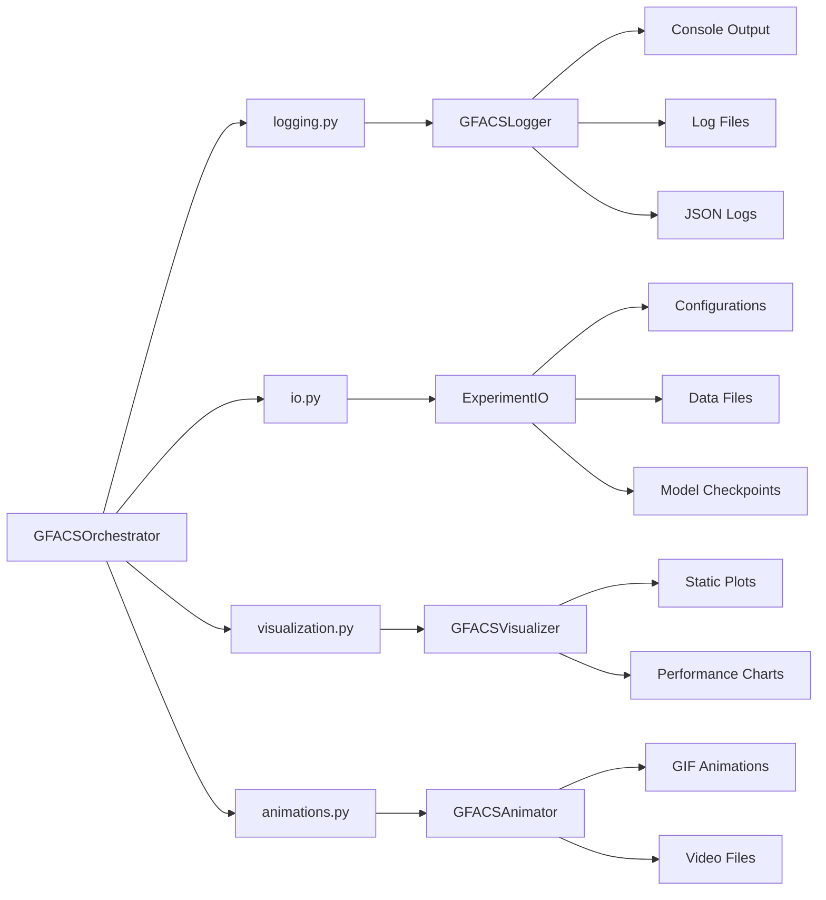

# Module: GFACS Utilities (`gfacs/utils/`)

## Overview

The GFACS utilities package provides comprehensive support for experiment management, logging, I/O operations, visualization, and animation generation. These utilities enable reproducible research, detailed performance tracking, and rich data presentation.

**Key Features:**
- Structured logging with file rotation and JSON output
- Comprehensive I/O management for experiment data
- Rich visualization generation for analysis
- Animation creation for algorithm dynamics
- Modular design with global instances

## Logging Module (`logging.py`)

### GFACSLogger - Structured Logger Class

```python
class GFACSLogger:
    """Structured logger for GFACS experiments.

    Provides:
    - Console logging with colors
    - File logging with rotation
    - JSON structured logging for analysis
    - Performance metrics logging
    - Memory usage tracking
    """

    def __init__(
        self,
        name: str = "gfacs",
        log_dir: Optional[Union[str, Path]] = None,
        log_level: str = "INFO",
        enable_file_logging: bool = True,
        enable_json_logging: bool = True,
        max_bytes: int = 10*1024*1024,  # 10MB
        backup_count: int = 5,
    ) -> None:
        """Initialize GFACS logger.

        Args:
            name: Logger name
            log_dir: Directory for log files (default: logs/)
            log_level: Logging level (DEBUG, INFO, WARNING, ERROR, CRITICAL)
            enable_file_logging: Whether to log to files
            enable_json_logging: Whether to log in JSON format
            max_bytes: Maximum log file size before rotation
            backup_count: Number of backup files to keep
        """
```

#### log_performance_metrics(metrics: Dict[str, Any], prefix: str = "") -> None

Log performance metrics with formatted output.

**Parameters:**
- `metrics` (Dict[str, Any]): Dictionary of metric names and values
- `prefix` (str): Optional prefix for metric names

#### log_memory_usage(device: str = "cpu") -> None

Log current memory usage.

**Parameters:**
- `device` (str): Device to check memory for ('cpu' or 'cuda')

#### log_experiment_start(experiment_name: str, config: Dict[str, Any]) -> None

Log experiment start with configuration.

**Parameters:**
- `experiment_name` (str): Name of the experiment
- `config` (Dict[str, Any]): Configuration dictionary

#### log_experiment_end(experiment_name: str, results: Dict[str, Any], duration: float) -> None

Log experiment completion.

**Parameters:**
- `experiment_name` (str): Name of the experiment
- `results` (Dict[str, Any]): Results dictionary
- `duration` (float): Experiment duration in seconds

#### log_problem_start(problem_name: str, config: Dict[str, Any]) -> None

Log problem simulation start.

**Parameters:**
- `problem_name` (str): Name of the problem
- `config` (Dict[str, Any]): Problem configuration

#### log_problem_end(problem_name: str, results: Dict[str, Any], duration: float) -> None

Log problem simulation completion.

**Parameters:**
- `problem_name` (str): Name of the problem
- `results` (Dict[str, Any]): Problem results
- `duration` (float): Problem duration in seconds

#### get_logger() -> logging.Logger

Get the underlying logger instance.

**Returns:**
- `logging.Logger`: Underlying logger object

### Module Functions

#### get_logger(name: str = "gfacs", log_dir: Optional[Union[str, Path]] = None, **kwargs) -> logging.Logger

Get or create a GFACS logger instance.

**Parameters:**
- `name` (str): Logger name
- `log_dir` (Optional[Union[str, Path]]): Log directory
- `**kwargs`: Additional arguments for GFACSLogger

**Returns:**
- `logging.Logger`: Logger instance

#### setup_experiment_logging(experiment_name: str, log_dir: Union[str, Path] = "logs", **logger_kwargs) -> logging.Logger

Setup logging for an experiment.

**Parameters:**
- `experiment_name` (str): Name of the experiment
- `log_dir` (Union[str, Path]): Base log directory
- `**logger_kwargs`: Additional logger arguments

**Returns:**
- `logging.Logger`: Configured logger instance

## I/O Module (`io.py`)

### ExperimentIO - Experiment I/O Manager

```python
class ExperimentIO:
    """Input/Output manager for GFACS experiments.

    Provides:
    - Experiment directory management
    - Input data persistence
    - Results saving
    - Checkpoint management
    - Metadata tracking
    """

    def __init__(self, base_dir: Union[str, Path] = "outputs") -> None:
        """Initialize experiment I/O manager.

        Args:
            base_dir: Base directory for experiment outputs
        """
```

#### create_experiment_dir(experiment_name: str, timestamp: bool = True) -> Path

Create experiment directory.

**Parameters:**
- `experiment_name` (str): Name of the experiment
- `timestamp` (bool): Whether to add timestamp to directory name

**Returns:**
- `Path`: Path to experiment directory

#### save_config(config: Any, experiment_dir: Path) -> None

Save experiment configuration.

**Parameters:**
- `config` (Any): Experiment configuration (dataclass or dict)
- `experiment_dir` (Path): Experiment directory

#### save_input_data(data: Dict[str, Any], experiment_dir: Path, filename: str = "input_data.pkl") -> None

Save input data (coordinates, demands, constraints, etc.).

**Parameters:**
- `data` (Dict[str, Any]): Input data dictionary
- `experiment_dir` (Path): Experiment directory
- `filename` (str): Output filename

#### save_problem_instance(problem_data: Dict[str, Any], experiment_dir: Path, problem_name: str, instance_name: str = "problem_instance") -> None

Save problem instance data.

**Parameters:**
- `problem_data` (Dict[str, Any]): Problem instance data
- `experiment_dir` (Path): Experiment directory
- `problem_name` (str): Name of the problem
- `instance_name` (str): Name for the instance

#### save_results(results: Dict[str, Any], experiment_dir: Path, filename: str = "results.json") -> None

Save experiment results.

**Parameters:**
- `results` (Dict[str, Any]): Results dictionary
- `experiment_dir` (Path): Experiment directory
- `filename` (str): Output filename

#### save_problem_results(results: Dict[str, Any], experiment_dir: Path, problem_name: str, filename: str = "results.json") -> None

Save problem-specific results.

**Parameters:**
- `results` (Dict[str, Any]): Problem results dictionary
- `experiment_dir` (Path): Experiment directory
- `problem_name` (str): Name of the problem
- `filename` (str): Output filename

#### save_training_metrics(metrics: Dict[str, List[float]], experiment_dir: Path, problem_name: str, filename: str = "training_metrics.json") -> None

Save training metrics over time.

**Parameters:**
- `metrics` (Dict[str, List[float]]): Dictionary of metric lists
- `experiment_dir` (Path): Experiment directory
- `problem_name` (str): Name of the problem
- `filename` (str): Output filename

#### save_checkpoint(model_state: Dict[str, Any], optimizer_state: Optional[Dict[str, Any]], epoch: int, metrics: Optional[Dict[str, float]], experiment_dir: Path, problem_name: str, filename: Optional[str] = None) -> Path

Save model checkpoint.

**Parameters:**
- `model_state` (Dict[str, Any]): Model state dictionary
- `optimizer_state` (Optional[Dict[str, Any]]): Optimizer state dictionary
- `epoch` (int): Current epoch
- `metrics` (Optional[Dict[str, float]]): Current metrics
- `experiment_dir` (Path): Experiment directory
- `problem_name` (str): Name of the problem
- `filename` (Optional[str]): Checkpoint filename

**Returns:**
- `Path`: Path to saved checkpoint

#### load_checkpoint(checkpoint_path: Union[str, Path]) -> Dict[str, Any]

Load model checkpoint.

**Parameters:**
- `checkpoint_path` (Union[str, Path]): Path to checkpoint file

**Returns:**
- `Dict[str, Any]`: Checkpoint dictionary

#### save_metadata(metadata: Dict[str, Any], experiment_dir: Path, filename: str = "metadata.json") -> None

Save experiment metadata.

**Parameters:**
- `metadata` (Dict[str, Any]): Metadata dictionary
- `experiment_dir` (Path): Experiment directory

#### save_summary(config: Any, results: Dict[str, Any], experiment_dir: Path) -> None

Save experiment summary.

**Parameters:**
- `config` (Any): Experiment configuration
- `results` (Dict[str, Any]): Experiment results
- `experiment_dir` (Path): Experiment directory

#### list_experiments() -> List[Path]

List all experiment directories.

**Returns:**
- `List[Path]`: List of experiment directory paths

#### load_experiment_results(experiment_dir: Union[str, Path]) -> Dict[str, Any]

Load experiment results.

**Parameters:**
- `experiment_dir` (Union[str, Path]): Experiment directory path

**Returns:**
- `Dict[str, Any]`: Dictionary containing all experiment data

#### _make_json_serializable(obj: Any) -> Any

Convert object to JSON serializable format.

**Parameters:**
- `obj` (Any): Object to convert

**Returns:**
- `Any`: JSON serializable version

### Module Functions

#### get_io_manager(base_dir: Union[str, Path] = "outputs") -> ExperimentIO

Get global I/O manager instance.

**Parameters:**
- `base_dir` (Union[str, Path]): Base directory for outputs

**Returns:**
- `ExperimentIO`: Global I/O manager instance

#### setup_experiment_io(experiment_name: str, config: Any, base_dir: Union[str, Path] = "outputs") -> tuple[Path, ExperimentIO]

Setup I/O for an experiment.

**Parameters:**
- `experiment_name` (str): Name of the experiment
- `config` (Any): Experiment configuration
- `base_dir` (Union[str, Path]): Base output directory

**Returns:**
- `tuple[Path, ExperimentIO]`: Tuple of (experiment_dir, io_manager)

## Visualization Module (`visualization.py`)

### GFACSVisualizer - Visualization Generator

```python
class GFACSVisualizer:
    """Visualization utilities for GFACS experiments."""

    def __init__(self, style: str = "whitegrid") -> None:
        """Initialize visualizer.

        Args:
            style: Seaborn style to use
        """
```

#### plot_tsp_tour(coordinates: Union[np.ndarray, torch.Tensor], tour: Optional[Union[np.ndarray, torch.Tensor]] = None, title: str = "TSP Tour", save_path: Optional[Union[str, Path]] = None, show_numbers: bool = False) -> plt.Figure

Plot TSP tour.

**Parameters:**
- `coordinates` (Union[np.ndarray, torch.Tensor]): Node coordinates [n_nodes, 2]
- `tour` (Optional[Union[np.ndarray, torch.Tensor]]): Tour indices (if None, plot points only)
- `title` (str): Plot title
- `save_path` (Optional[Union[str, Path]]): Path to save plot
- `show_numbers` (bool): Whether to show node numbers

**Returns:**
- `plt.Figure`: Matplotlib figure

#### plot_cvrp_routes(coordinates: Union[np.ndarray, torch.Tensor], routes: List[Union[np.ndarray, torch.Tensor]], demands: Optional[Union[np.ndarray, torch.Tensor]] = None, capacity: float = 1.0, title: str = "CVRP Routes", save_path: Optional[Union[str, Path]] = None) -> plt.Figure

Plot CVRP routes.

**Parameters:**
- `coordinates` (Union[np.ndarray, torch.Tensor]): Node coordinates [n_nodes, 2]
- `routes` (List[Union[np.ndarray, torch.Tensor]]): List of routes (each route is a sequence of node indices)
- `demands` (Optional[Union[np.ndarray, torch.Tensor]]): Node demands for sizing
- `capacity` (float): Vehicle capacity
- `title` (str): Plot title
- `save_path` (Optional[Union[str, Path]]): Path to save plot

**Returns:**
- `plt.Figure`: Matplotlib figure

#### plot_convergence(metrics: Dict[str, List[float]], title: str = "Training Convergence", save_path: Optional[Union[str, Path]] = None) -> plt.Figure

Plot training convergence curves.

**Parameters:**
- `metrics` (Dict[str, List[float]]): Dictionary of metric lists
- `title` (str): Plot title
- `save_path` (Optional[Union[str, Path]]): Path to save plot

**Returns:**
- `plt.Figure`: Matplotlib figure

#### plot_solution_quality_distribution(solutions: List[float], optimal: Optional[float] = None, title: str = "Solution Quality Distribution", save_path: Optional[Union[str, Path]] = None) -> plt.Figure

Plot distribution of solution qualities.

**Parameters:**
- `solutions` (List[float]): List of solution costs/objectives
- `optimal` (Optional[float]): Optimal solution value (if known)
- `title` (str): Plot title
- `save_path` (Optional[Union[str, Path]]): Path to save plot

**Returns:**
- `plt.Figure`: Matplotlib figure

#### plot_pheromone_matrix(pheromone: Union[np.ndarray, torch.Tensor], title: str = "Pheromone Matrix", save_path: Optional[Union[str, Path]] = None) -> plt.Figure

Plot pheromone matrix as heatmap.

**Parameters:**
- `pheromone` (Union[np.ndarray, torch.Tensor]): Pheromone matrix
- `title` (str): Plot title
- `save_path` (Optional[Union[str, Path]]): Path to save plot

**Returns:**
- `plt.Figure`: Matplotlib figure

#### plot_parameter_sensitivity(parameter_values: List[float], performances: List[float], parameter_name: str = "Parameter", title: str = "Parameter Sensitivity Analysis", save_path: Optional[Union[str, Path]] = None) -> plt.Figure

Plot parameter sensitivity analysis.

**Parameters:**
- `parameter_values` (List[float]): Parameter values tested
- `performances` (List[float]): Performance metrics for each value
- `parameter_name` (str): Name of the parameter
- `title` (str): Plot title
- `save_path` (Optional[Union[str, Path]]): Path to save plot

**Returns:**
- `plt.Figure`: Matplotlib figure

#### plot_runtime_comparison(methods: List[str], runtimes: List[float], title: str = "Runtime Comparison", save_path: Optional[Union[str, Path]] = None) -> plt.Figure

Plot runtime comparison across methods.

**Parameters:**
- `methods` (List[str]): Method names
- `runtimes` (List[float]): Runtime values in seconds
- `title` (str): Plot title
- `save_path` (Optional[Union[str, Path]]): Path to save plot

**Returns:**
- `plt.Figure`: Matplotlib figure

#### plot_cross_problem_comparison(problem_results: Dict[str, Dict[str, float]], metric: str = "best_cost", title: str = "Cross-Problem Performance Comparison", save_path: Optional[Union[str, Path]] = None) -> plt.Figure

Plot cross-problem performance comparison.

**Parameters:**
- `problem_results` (Dict[str, Dict[str, float]]): Dictionary of problem results
- `metric` (str): Metric to compare
- `title` (str): Plot title
- `save_path` (Optional[Union[str, Path]]): Path to save plot

**Returns:**
- `plt.Figure`: Matplotlib figure

#### create_experiment_report(experiment_dir: Union[str, Path], save_path: Optional[Union[str, Path]] = None) -> plt.Figure

Create comprehensive experiment report visualization.

**Parameters:**
- `experiment_dir` (Union[str, Path]): Experiment directory
- `save_path` (Optional[Union[str, Path]]): Path to save report

**Returns:**
- `plt.Figure`: Matplotlib figure with multiple subplots

### Module Functions

#### get_visualizer() -> GFACSVisualizer

Get global visualizer instance.

**Returns:**
- `GFACSVisualizer`: Global visualizer instance

#### plot_tsp_solution(coordinates: Union[np.ndarray, torch.Tensor], tour: Union[np.ndarray, torch.Tensor], cost: float, save_path: Optional[Union[str, Path]] = None, title: Optional[str] = None) -> plt.Figure

Plot TSP solution.

**Parameters:**
- `coordinates` (Union[np.ndarray, torch.Tensor]): Node coordinates
- `tour` (Union[np.ndarray, torch.Tensor]): Tour indices
- `cost` (float): Tour cost
- `save_path` (Optional[Union[str, Path]]): Path to save plot
- `title` (Optional[str]): Plot title

**Returns:**
- `plt.Figure`: Matplotlib figure

#### plot_training_progress(metrics: Dict[str, List[float]], experiment_dir: Union[str, Path], save_path: Optional[Union[str, Path]] = None) -> plt.Figure

Plot training progress.

**Parameters:**
- `metrics` (Dict[str, List[float]]): Training metrics
- `experiment_dir` (Union[str, Path]): Experiment directory for title
- `save_path` (Optional[Union[str, Path]]): Path to save plot

**Returns:**
- `plt.Figure`: Matplotlib figure

#### save_experiment_visualizations(experiment_dir: Union[str, Path], coordinates: Optional[Union[np.ndarray, torch.Tensor]] = None, tour: Optional[Union[np.ndarray, torch.Tensor]] = None, cost: Optional[float] = None, metrics: Optional[Dict[str, List[float]]] = None, pheromone_matrix: Optional[Union[np.ndarray, torch.Tensor]] = None) -> None

Save all relevant visualizations for an experiment.

**Parameters:**
- `experiment_dir` (Union[str, Path]): Experiment directory
- `coordinates` (Optional[Union[np.ndarray, torch.Tensor]]): Node coordinates (for TSP/CVRP)
- `tour` (Optional[Union[np.ndarray, torch.Tensor]]): Solution tour/route
- `cost` (Optional[float]): Solution cost
- `metrics` (Optional[Dict[str, List[float]]]): Training metrics
- `pheromone_matrix` (Optional[Union[np.ndarray, torch.Tensor]]): Pheromone matrix for visualization

## Animation Module (`animations.py`)

### GFACSAnimator - Animation Generator

```python
class GFACSAnimator:
    """Animation utilities for GFACS experiments."""

    def __init__(self, fps: int = 10, bitrate: int = 1800) -> None:
        """Initialize animator.

        Args:
            fps: Frames per second for animations
            bitrate: Video bitrate
        """
```

#### create_tsp_construction_animation(coordinates: Union[np.ndarray, torch.Tensor], tour_history: List[Union[np.ndarray, torch.Tensor]], costs: Optional[List[float]] = None, title: str = "TSP Tour Construction", save_path: Optional[Union[str, Path]] = None) -> animation.Animation

Create animation of TSP tour construction.

**Parameters:**
- `coordinates` (Union[np.ndarray, torch.Tensor]): Node coordinates [n_nodes, 2]
- `tour_history` (List[Union[np.ndarray, torch.Tensor]]): List of partial tours at each step
- `costs` (Optional[List[float]]): Cost history for display
- `title` (str): Animation title
- `save_path` (Optional[Union[str, Path]]): Path to save animation

**Returns:**
- `animation.Animation`: Matplotlib animation object

#### create_pheromone_evolution_animation(pheromone_history: List[Union[np.ndarray, torch.Tensor]], title: str = "Pheromone Matrix Evolution", save_path: Optional[Union[str, Path]] = None) -> animation.Animation

Create animation of pheromone matrix evolution.

**Parameters:**
- `pheromone_history` (List[Union[np.ndarray, torch.Tensor]]): List of pheromone matrices over time
- `title` (str): Animation title
- `save_path` (Optional[Union[str, Path]]): Path to save animation

**Returns:**
- `animation.Animation`: Matplotlib animation object

#### create_convergence_animation(cost_history: List[float], title: str = "ACO Convergence", save_path: Optional[Union[str, Path]] = None) -> animation.Animation

Create animation of convergence over iterations.

**Parameters:**
- `cost_history` (List[float]): List of best costs over iterations
- `title` (str): Animation title
- `save_path` (Optional[Union[str, Path]]): Path to save animation

**Returns:**
- `animation.Animation`: Matplotlib animation object

#### create_cvrp_route_animation(coordinates: Union[np.ndarray, torch.Tensor], route_history: List[List[Union[np.ndarray, torch.Tensor]]], title: str = "CVRP Route Construction", save_path: Optional[Union[str, Path]] = None) -> animation.Animation

Create animation of CVRP route construction.

**Parameters:**
- `coordinates` (Union[np.ndarray, torch.Tensor]): Node coordinates [n_nodes, 2]
- `route_history` (List[List[Union[np.ndarray, torch.Tensor]]]): List of routes at each step (list of routes per vehicle)
- `title` (str): Animation title
- `save_path` (Optional[Union[str, Path]]): Path to save animation

**Returns:**
- `animation.Animation`: Matplotlib animation object

#### create_multi_problem_comparison_animation(problem_results: Dict[str, List[float]], title: str = "Multi-Problem Performance Comparison", save_path: Optional[Union[str, Path]] = None) -> animation.Animation

Create animation comparing multiple problems.

**Parameters:**
- `problem_results` (Dict[str, List[float]]): Dict of problem_name -> cost_history
- `title` (str): Animation title
- `save_path` (Optional[Union[str, Path]]): Path to save animation

**Returns:**
- `animation.Animation`: Matplotlib animation object

#### _save_animation(anim: animation.Animation, save_path: Union[str, Path], writer: str = 'pillow') -> None

Save animation to file.

**Parameters:**
- `anim` (animation.Animation): Matplotlib animation
- `save_path` (Union[str, Path]): Path to save animation
- `writer` (str): Animation writer ('pillow' for GIF, 'ffmpeg' for MP4)

#### _save_as_png_series(anim: animation.Animation, base_path: Union[str, Path]) -> None

Save animation as series of PNG files.

**Parameters:**
- `anim` (animation.Animation): Matplotlib animation
- `base_path` (Union[str, Path]): Base path for PNG files

### Module Functions

#### get_animator() -> GFACSAnimator

Get global animator instance.

**Returns:**
- `GFACSAnimator`: Global animator instance

#### create_tsp_tour_animation(coordinates: Union[np.ndarray, torch.Tensor], tour_history: List[Union[np.ndarray, torch.Tensor]], save_path: Optional[Union[str, Path]] = None, title: str = "TSP Tour Construction") -> animation.Animation

Create TSP tour construction animation.

**Parameters:**
- `coordinates` (Union[np.ndarray, torch.Tensor]): Node coordinates
- `tour_history` (List[Union[np.ndarray, torch.Tensor]]): History of tour construction
- `save_path` (Optional[Union[str, Path]]): Path to save animation
- `title` (str): Animation title

**Returns:**
- `animation.Animation`: Matplotlib animation

#### create_convergence_animation(cost_history: List[float], save_path: Optional[Union[str, Path]] = None, title: str = "ACO Convergence") -> animation.Animation

Create convergence animation.

**Parameters:**
- `cost_history` (List[float]): History of best costs
- `save_path` (Optional[Union[str, Path]]): Path to save animation
- `title` (str): Animation title

**Returns:**
- `animation.Animation`: Matplotlib animation

#### create_pheromone_animation(pheromone_history: List[Union[np.ndarray, torch.Tensor]], save_path: Optional[Union[str, Path]] = None, title: str = "Pheromone Evolution") -> animation.Animation

Create pheromone evolution animation.

**Parameters:**
- `pheromone_history` (List[Union[np.ndarray, torch.Tensor]]): History of pheromone matrices
- `save_path` (Optional[Union[str, Path]]): Path to save animation
- `title` (str): Animation title

**Returns:**
- `animation.Animation`: Matplotlib animation

#### create_animation(animation_type: str, **kwargs) -> animation.Animation

Create animation of specified type.

**Parameters:**
- `animation_type` (str): Type of animation ('tsp', 'convergence', 'pheromone', 'cvrp', 'comparison')
- `**kwargs`: Animation-specific arguments

**Returns:**
- `animation.Animation`: Matplotlib animation

#### save_experiment_animations(experiment_dir: Union[str, Path], coordinates: Optional[Union[np.ndarray, torch.Tensor]] = None, tour_history: Optional[List[Union[np.ndarray, torch.Tensor]]] = None, cost_history: Optional[List[float]] = None, pheromone_history: Optional[List[Union[np.ndarray, torch.Tensor]]] = None) -> None

Save all relevant animations for an experiment.

**Parameters:**
- `experiment_dir` (Union[str, Path]): Experiment directory
- `coordinates` (Optional[Union[np.ndarray, torch.Tensor]]): Node coordinates for TSP
- `tour_history` (Optional[List[Union[np.ndarray, torch.Tensor]]]): TSP tour construction history
- `cost_history` (Optional[List[float]]): Convergence cost history
- `pheromone_history` (Optional[List[Union[np.ndarray, torch.Tensor]]]): Pheromone matrix evolution

## Utility Module Relationships



## Usage Examples

### Experiment Setup with Utilities

```python
from gfacs.utils import get_logger, setup_experiment_logging, get_io_manager, setup_experiment_io, get_visualizer, get_animator

# Setup logging
logger = setup_experiment_logging("my_experiment")

# Setup I/O
experiment_dir, io_manager = setup_experiment_io("my_experiment", config)

# Get visualizers
visualizer = get_visualizer()
animator = get_animator()

# Log experiment start
logger.info("🚀 Starting experiment")
```

### Complete Experiment Workflow

```python
# Save configuration
io_manager.save_config(config, experiment_dir)

# Save input data
input_data = {"coordinates": coordinates, "demands": demands}
io_manager.save_input_data(input_data, experiment_dir)

# Save results
results = {"best_cost": best_cost, "convergence": cost_history}
io_manager.save_results(results, experiment_dir)

# Generate visualizations
visualizer.plot_convergence({"cost": cost_history}, save_path=experiment_dir / "visualizations" / "convergence.png")

# Generate animations
animator.create_convergence_animation(cost_history, save_path=experiment_dir / "animations" / "convergence.gif")

# Log completion
logger.info(f"✅ Experiment completed - Best cost: {best_cost}")
```

### Custom Logging

```python
logger = get_logger("custom_experiment", log_level="DEBUG")

# Log metrics
metrics = {"loss": 0.123, "accuracy": 0.95}
logger.log_performance_metrics(metrics, prefix="train_")

# Log memory usage
logger.log_memory_usage(device="cuda")

# Log experiment events
logger.log_experiment_start("custom_experiment", {"lr": 1e-3, "batch_size": 32})
```

## Dependencies

### Required
- `logging`: Python standard library logging
- `pathlib`: Path handling
- `json`: JSON serialization
- `pickle`: Python object serialization
- `yaml`: YAML configuration parsing
- `datetime`: Timestamp generation

### Optional (for visualization)
- `matplotlib`: Plotting and visualization
- `seaborn`: Statistical visualization styling
- `pandas`: Data manipulation for summaries
- `numpy`: Numerical computations
- `torch`: PyTorch tensor handling

### Optional (for animation)
- `matplotlib.animation`: Animation framework
- `imageio`: GIF generation
- `seaborn`: Color palettes

## Performance Characteristics

### Logging Module
- **Memory**: Minimal overhead, efficient string formatting
- **Storage**: Configurable file rotation (default 10MB)
- **Performance**: Asynchronous file writing, buffered output

### I/O Module
- **File Formats**: JSON, YAML, Pickle, CSV support
- **Directory Structure**: Hierarchical organization
- **Error Handling**: Robust file operations with fallbacks

### Visualization Module
- **Backends**: Matplotlib with optional Seaborn styling
- **Formats**: PNG, PDF, SVG output
- **Performance**: Vector graphics for scalability

### Animation Module
- **Formats**: GIF (Pillow), MP4 (FFmpeg)
- **Frame Rate**: Configurable FPS (default 10)
- **Compression**: Optimized bitrate settings

## Error Handling

All utility modules include comprehensive error handling:

- **Missing Dependencies**: Graceful degradation for optional libraries
- **File System Errors**: Robust directory creation and permission handling
- **Data Serialization**: JSON-compatible data conversion
- **Animation Failures**: Fallback to PNG series for unsupported formats
- **Visualization Errors**: Skip failed plots, continue with others

## Extensibility

### Adding Custom Visualizations
```python
class CustomVisualizer(GFACSVisualizer):
    def plot_custom_metric(self, data, **kwargs):
        # Custom plotting logic
        fig, ax = plt.subplots()
        # ... custom visualization ...
        return fig

# Register custom visualizer
visualizer = CustomVisualizer()
```

### Custom Animation Types
```python
def create_custom_animation(data, **kwargs):
    fig, ax = plt.subplots()
    # Custom animation logic
    return animation.FuncAnimation(fig, animate_func, frames=len(data))

# Add to module
create_custom_animation = create_custom_animation
```

### Extended I/O Formats
```python
def save_custom_format(data, path):
    # Custom serialization logic
    with open(path, 'custom_format') as f:
        f.write(custom_serialize(data))

# Extend ExperimentIO
ExperimentIO.save_custom_data = save_custom_format
```

## Testing and Validation

### Unit Tests
- Logger configuration and output verification
- I/O operations and file format validation
- Visualization plot generation and saving
- Animation creation and file output
- Error handling for missing dependencies

### Integration Tests
- End-to-end experiment workflow
- Output directory structure validation
- Cross-module interaction testing
- Performance benchmarking

### Validation Metrics
- File I/O performance
- Memory usage during visualization
- Animation generation times
- Log file sizes and rotation behavior