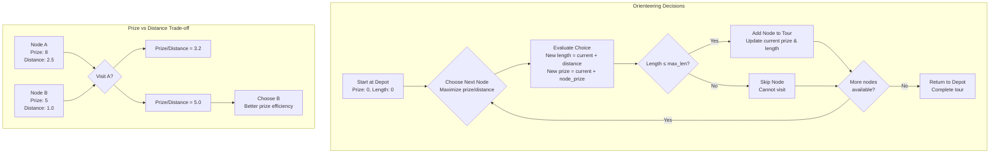

# GFACS for Orienteering Problem

This module implements ACO with GFlowNet sampling for the Orienteering Problem (OP). The goal is to maximize collected prizes while respecting a maximum tour length constraint, with selective node visiting.

## Problem Description

OP involves finding a tour that:
- **Maximizes Prizes**: Collect valuable items at nodes
- **Length Constraint**: Tour length ≤ maximum allowed
- **Selective Visiting**: Not all nodes need to be visited
- **Start/End**: Begin and end at depot (node 0)

## Selective Visiting Strategy



## ACO Flow for Prize Collection

```mermaid
graph TB
    subgraph "Ant Construction"
        Depot[Start at Depot<br/>Tour: [0], Length: 0, Prize: 0] --> Available[Available Nodes<br/>Not visited, feasible]

        Available --> Select{Select Node<br/>Pheromone + Heuristic}

        Select --> LengthCheck{Check Length<br/>Current + distance ≤ max_len?}

        LengthCheck -->|Yes| AddToTour[Add to Tour<br/>Update length & prize]
        LengthCheck -->|No| MarkInfeasible[Mark as infeasible<br/>for this ant]

        AddToTour --> Available
        MarkInfeasible --> Available

        Available --> Complete{Max length reached<br/>or no more nodes?}
        Complete -->|Yes| FinishTour[Return to Depot]
    end

    subgraph "Solution Evaluation"
        FinishTour --> CalcPrize[Calculate Total Prize<br/>Σ visited node prizes]
        CalcPrize --> CalcLength[Calculate Tour Length<br/>Σ distances between nodes]

        CalcLength --> Feasible{Feasible?<br/>Length ≤ max_len}
        Feasible -->|Yes| Valid[Valid Solution<br/>Fitness = total prize]
        Feasible -->|No| Invalid[Invalid Solution<br/>Fitness = 0]
    end

    subgraph "Pheromone Learning"
        Valid --> UpdatePhero[Update Pheromone<br/>Reinforce successful paths]
        Invalid --> NoUpdate[No pheromone update<br/>Infeasible solutions ignored]
    end
```

## Installation

### Prerequisites
- PyTorch 2.1.1+ (CUDA recommended)
- NumPy, Numba for performance

## Dataset Generation

```bash
python utils.py
```

Generates OP instances with random prizes and coordinates.

## Training

```bash
python train.py $N
```

### Options
- `--batch-size`: Batch size (default: 20)
- `--epochs`: Training epochs (default: 50)
- `--guided-exploration`: Use guided exploration

## Testing

```bash
python test.py $N -p "checkpoint"
```

## Architecture

- **Prize Features**: Node embeddings include prize values
- **Length Tracking**: Construction respects tour length limits
- **Selective Decisions**: Neural network chooses which nodes to visit

## Usage Example

```python
from gfacs.op.aco import ACO
from gfacs.op.net import Net

# Generate instance
coordinates = torch.rand(n_nodes, 2)
prizes = torch.rand(n_nodes) * 10
max_len = 5.0

aco = ACO(distances=distances, prizes=prizes, max_len=max_len, heuristic=heu_mat)
prizes, log_probs, paths = aco.sample()
```

## Performance

OP focuses on prize maximization under length constraints, with neural guidance for node selection decisions.

## File Structure

```
op/
├── aco.py
├── net.py
├── train.py
├── test.py
├── utils.py
├── README.md
└── AGENTS.md
```
