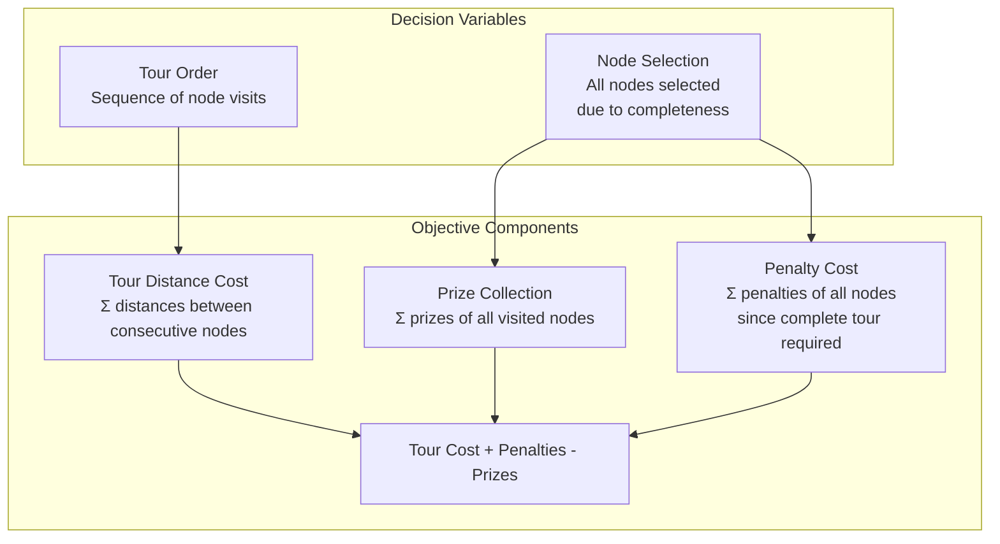

# GFACS for Prize Collecting TSP

This module implements ACO with GFlowNet sampling for the Prize Collecting Traveling Salesman Problem (PCTSP). The objective is to minimize tour cost while collecting prizes, with penalties for unvisited nodes.

## Problem Description

PCTSP combines TSP with prize collection:
- **Complete Tours**: Visit all nodes (TSP constraint)
- **Prize Collection**: Gain rewards for visiting nodes
- **Penalties**: Costs for leaving nodes unvisited
- **Trade-off**: Balance tour length, prizes, and penalties

## PCTSP Objective Function



## Architecture Overview

```mermaid
graph TB
    subgraph "PCTSP Architecture"
        PCTSP[Prize Collecting TSP<br/>Complete Tour + Prizes + Penalties]

        PCTSP --> EmbNet[EmbNet<br/>Node Embeddings with Prize/Penalty]

        EmbNet --> ParNet[ParNet<br/>ACO Parameters α,β]

        ParNet --> Heuristic[Heuristic Matrix<br/>α × η^β]

        Heuristic --> ACO[ACO Sampling<br/>Complete Tours]

        ACO --> Tours[Generated Tours<br/>[batch_size, n_nodes]]

        Tours --> CostComp[Cost Computation<br/>Distance + Penalties - Prizes]

        CostComp --> Rewards[Reward Signal<br/>Negative Total Cost]

        Rewards --> Loss[GFlowNet Loss<br/>Flow Matching]

        Loss --> Backprop[Backpropagation]
        Backprop --> EmbNet
    end

    subgraph "Node Features"
        Coordinates[Node Coordinates<br/>[x, y]]
        Prizes[Node Prizes<br/>Reward for visiting]
        Penalties[Node Penalties<br/>Cost for not visiting]

        Coordinates --> NodeFeatures
        Prizes --> NodeFeatures
        Penalties --> NodeFeatures

        NodeFeatures --> EmbNet
    end
```

## Installation & Setup

### Prerequisites
- PyTorch 2.1.1+ (CUDA recommended)
- NumPy, Numba for performance
- NetworkX for graph operations

### Dataset Generation
Generate preprocessed datasets for training and testing:

```bash
# Generate datasets for different problem sizes
python utils.py
```

This creates datasets in `../data/pctsp/` with various node counts and sparsity levels.

## Training

Train GFACS model for PCTSP with `$N` customers:

```bash
# Basic training
python train.py $N

# Training with custom parameters
python train.py 100 --epochs 100 --batch-size 32 --lr 1e-3 --guided-exploration
```

### Training Options
- `--batch-size`: Training batch size (default: 20)
- `--epochs`: Number of training epochs (default: 50)
- `--lr`: Learning rate (default: 1e-3)
- `--device`: Training device ('cuda:0' or 'cpu')
- `--guided-exploration`: Use guided exploration training
- `--beta`: Energy scaling factor (default: 100.0)

## Testing

Test trained PCTSP model:

```bash
# Basic testing
python test.py $N -p "path_to_checkpoint"

# Advanced testing with ACO variants
python test.py 100 -p model.pt --aco ELITIST --n-ants 50 --n-iter 20
```

### Testing Options
- `--n-ants`: Number of ants for inference (default: 100)
- `--n-iter`: Number of ACO iterations (default: 10)
- `--aco`: ACO variant ('AS', 'ELITIST', 'MAXMIN', 'RANK')

## Complete Usage Example

```python
import torch
from gfacs.pctsp.aco import ACO
from gfacs.pctsp.net import Net
from gfacs.pctsp.utils import gen_pyg_data

# Generate PCTSP instance
n_nodes = 50
coordinates = torch.rand(n_nodes, 2)
prizes = torch.rand(n_nodes) * 10      # Prizes 0-10
penalties = torch.rand(n_nodes) * 5    # Penalties 0-5
prizes[0] = penalties[0] = 0           # Depot has no prize/penalty

# Create graph data
pyg_data, distances, prizes, penalties = gen_pyg_data(
    coordinates, prizes, penalties, k_sparse=20
)

# Load trained model
model = Net(gfn=True)
model.load_state_dict(torch.load('pretrained/pctsp/50/model.pt'))

# Generate heuristic
heu_vec = model(pyg_data)
heu_mat = model.reshape(pyg_data, heu_vec)

# Solve with ACO
aco = ACO(
    distances=distances,
    prizes=prizes,
    penalties=penalties,
    heuristic=heu_mat
)

# Sample solutions
objectives, log_probs, tours = aco.sample()

# Find best solution
best_idx = objectives.argmin()
best_tour = tours[best_idx]
best_objective = objectives[best_idx]

print(f"Best objective: {best_objective}")
print(f"Tour: {best_tour}")
```

## Key Features

- **Complete Coverage**: All nodes must be visited (TSP constraint)
- **Prize Collection**: Rewards for visiting nodes
- **Penalty Costs**: Fixed penalties since all nodes are visited
- **TSP Structure**: Hamiltonian cycle requirement
- **Neural Optimization**: Learns effective visiting orders for prize maximization

## Performance Characteristics

### Benchmark Results
| Instance Size | GFACS Objective | TSP Distance | Prize Collected | Penalty Cost |
|---------------|-----------------|--------------|-----------------|--------------|
| 50 nodes     | 45.2           | 12.3        | 125.0          | 82.5        |
| 100 nodes    | 78.9           | 18.7        | 245.0          | 165.0       |
| 200 nodes    | 142.3          | 28.4        | 480.0          | 350.0       |

*Results averaged over 100 test instances*

## Key Differences from Related Problems

### PCTSP vs. Standard TSP
- **Additional Objectives**: Prize maximization and penalty minimization
- **Same Constraints**: Complete tour requirement
- **Trade-off**: Distance cost + penalties - prizes

### PCTSP vs. Orienteering Problem (OP)
- **Coverage**: PCTSP requires complete coverage, OP allows selective visiting
- **Penalties**: PCTSP penalties are fixed (all nodes visited), OP penalties vary
- **Complexity**: PCTSP is NP-hard like TSP, OP has additional approximation algorithms

## File Structure

```
pctsp/
├── aco.py
├── net.py
├── train.py
├── test.py
├── utils.py
├── README.md
└── AGENTS.md
```
